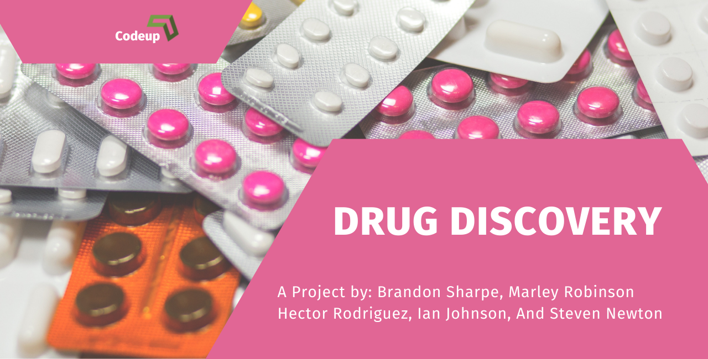

<h1>Drug Discovery

# Table of Contents 
0. [Domain Context](#domain_context)
    1. [ Discovering Drugs](#drug_disc)
1. [Project Planning](#project_planning)
    1. [Project Objectives](#project_objectives)
    2. [Audience](#audience)
    3. [Deliverables](#deliverables)
2. [Executive Summary](#exe_sum)
    1. [Goals](#goals)
    2. [Findings](#findings)
3. [Acquire Data](#acquire)
    1. [Data Dictonary](#data_dict)
    2. [Acquire Takeaways](#acquire_takeaways)
4. [Prepare Data](#prep_data)
    1. [Distributions](#distributions)
    2. [Prepare Takeaways](#prepare_takeaways)
5. [Data Exploration](#explore)
    1. [Explore Takeaways](#explore_takeaways)
    2. [Hypothesis](#hypothesis)
6. [Modeling & Evaluation](#modeling)
    1. [Modeling Takeaways](#model_takeaways)
6. [Project Delivery](#delivery)
    1. [Conclusions & Next Steps](#conclusions_next_steps)
    2. [Project Replication](#replication)

## Domain Context
✓ 🧪 **Context** ➜ ☐ _Plan_ ➜ ☐ _Acquire_ ➜ ☐ _Prepare_ ➜ ☐ _Explore_ ➜ ☐ _Model_ ➜ ☐ _Deliver_

### Discovering Drugs
*A Chemical Compound Analysis for Fighting Diseases* 

This projects goal is to predict the effectiveness of chemical compounds for treating a disease or virus. This prediction can be used to pre-screen drugs before expensive and time-consuming lab experiments. This is especially important considering that, on average, only 9% drugs get approved by the FDA per year and the cost of bringing a new drug to market is estimated to be $ 2.6 billion, much of which is spent on testing drugs that may have little to no effectivity.

## Project Planning
✓ 🟢 **Plan** ➜ ☐ _Acquire_ ➜ ☐ _Prepare_ ➜ ☐ _Explore_ ➜ ☐ _Model_ ➜ ☐ _Deliver_

- [x] Create README.md with data dictionary, project and business goals.
- [x] Acquire data from ChEMBL and create a series of functions to automate this process. Save the functions in an acquire.py file located in the source folder to import into the Final Report Notebook.
- [x] Clean and prepare data for the first iteration through the pipeline, MVP preparation. Create a series of functions to automate the process, store the functions in a prepare.py module held in the source folder, and prepare data in Final Report Notebook by importing and using the funtions.
- [x] Establish a baseline accuracy and document.
- [x] Train multiple different regression models on train dataset using Classes.
- [x] Train multiple different classification models on train dataset using Classes.
- [x] Train an ANN model on train dataset.
- [x] Evaluate models on test dataset.
- [x] Document conclusions, takeaways, and next steps in the Final Report Notebook.
- [x] All steps are detailed in: [Trello](https://trello.com/b/IGNcnEfy/drug-discovery)

### Project Objectives
> The goal of this project was to accuratley classify or predict if a chemical coumpond would be an effective canidate for research against certain a disease. This project was designed to take in diseases and viruses as inputs and using the ChEMBL database compare various chemical compounds against the target to determine its efffectivness as a drug candidate. 

### Audience
> - 

### Deliverables
>  Deliver 10 minute presentation walkthrough and slide presentation communicating to our stakeholders:
- [x] Executive summary
- [x] Data introduction and explanation
    * Imports and special libraries used
- [x] Exploration of features
- [x] Creation of regression models
- [x] Creation of classification models
- [x] Creation of ANN models
- [x] The impact
- [x] Conclusion

<a href='#toc'>Table of Contents</a>

## Executive Summary
> -

### Goals
> -

### Findings
> -

<a href='#toc'>Table of Contents</a>

## Acquire Data
✓ _Plan_ ➜ 🟢 **Acquire** ➜ ☐ _Prepare_ ➜ ☐ _Explore_ ➜ ☐ _Model_ ➜ ☐ _Deliver_

> Data was acquired using the ChEMBL websource client. ChEMBL is a manually curated database of bioactive molecules with drug-like properties. It brings together chemical, bioactivity and genomic data to aid the translation of genomic information into effective new drugs.
- [x] pip install chembl_webresource_client that gets data from ChEMBL server
- [x] pip instal rdkit an open source cheminformatics library that helps us get vital information from each chemical coumpound
- [x] search for the target in our search function. Returns all ChEMBL entries for target
    

### DataFrame Dict

| Feature            | Datatype             | Definition   |
|:-------------------|:---------------------|:-------------|
| molecule_chembl_id | 12 non-null: object  |Unique ChEMBL identifier for each chemical compound|
| canonical_smiles   | 12 non-null: object  |A string to represent a 2D molecular graph as a 1D string|
| standard_value     | 12 non-null: float64 |              |
| bioactivity_class  | 12 non-null: object  |The activity classificaction of the chemical compound in camparison to the target. (Active, Inactive, Intermediate) |
| MW                 | 12 non-null: float64 |The molecular weight of the chemical compound|
| LogP               | 12 non-null: float64 |Solubility or Permiability of the chemical compound. The lower the number the more solubale it is in water. The higher it is the more permiable it is in fat|
| NumHDonors         | 12 non-null: float64 |Number of hydrogen donors the chemical compound has|
| NumHAcceptors      | 12 non-null: float64 |Number of hydrogen acceptors the chemical compound has|
| pIC50              | 12 non-null: float64 |**TARGET** Inverse log of IC50 converted to molar. IC50 is the most widely used and informative measure of a drug's efficacy. It indicates how much drug is needed to inhibit a biological process by half, thus providing a measure of potency of an antagonist drug in pharmacological research.|

### Takeaways from Acquire:
> -

<a href='#toc'>Table of Contents</a>

## Prepare Data
✓ _Plan_ ➜ ✓ _Acquire_ ➜ 🟢 **Prepare** ➜ ☐ _Explore_ ➜ ☐ _Model_ ➜ ☐ _Deliver_

> - The acquire and preparation of the data had to be automized by the use of scripts for ease of use and readability. The data acquired from ChEMBL needed the lipinski rules (Molecular weight, LogP, H donors, H acceptors, and pIC50) applied. The chemical fingerprint was then created using the canocial smile.The chemical fingerprint is a unique pattern indicating the presence of a particular molecule, based on specialized analytic techniques such as mass- or x-ray-spectroscopy, used to identify a pollutant, drug, contaminant, or other chemical in a test sample. ChEMBL is a manualy currated list of chemical compounds, because of this most conventional cleaning steps are not needed because the problems are not present. 
- [x] Apply Lipinski's  Rules to the acquired data
- [x] Create a dataframe containg the chemical fingerprints of each chemmical compound
- [x] 

### Prepare Takeaways
> - The data was cleaned and is ready for exploration on the train data set.

<a href='#toc'>Table of Contents</a>

## Explore Data
✓ _Plan_ ➜ ✓ _Acquire_ ➜ ✓ _Prepare_ ➜ 🟢 **Explore** ➜ ☐ _Model_ ➜ ☐ _Deliver_

> -

### Explore Takeaways
> -

<a href='#toc'>Table of Contents</a>

### Hypothesis Testing
> - Mann-Whitney U tests for molecular descriptors (active vs. inactive).

#### Hypothesis 1
> - (H0)There is no significant difference in the distibution of Molecular Weight between active and inactive chemical compounds?
    - U statistic = 0, p = 0.013
    - There is a different distribution. We can reject H0.
#### Hypothesis 2
> - (H0)There is no significant difference in the distibution of LogP between active and inactive chemical compounds?
    - U statistic = 6, p = 0.256
    - They have the same distribution. We fail to reject H0.
#### Hypothesis 3
> - (H0)There is no significant difference in the distibution of the number of hydrogen donors between active and inactive chemical compounds?
    - U statistic = 0, p = 0.010
    - There is a different distribution. We can reject H0.
#### Hypothesis 4
> - (H0)There is no significant difference in the distibution of the number of hydrogen acceptors between active and inactive chemical compounds?
    - U statistic = 8, p = 0.319
    - They have the same distribution. We fail to reject H0.

## Modeling & Evaluation
✓ _Plan_ ➜ ✓ _Acquire_ ➜ ✓ _Prepare_ ➜ ✓ _Explore_ ➜ 🟢 **Model** ➜ ☐ _Deliver_

> -

### Modeling Takeaways
> -

<a href='#toc'>Table of Contents</a>

## Project Delivery
✓ _Plan_ ➜ ✓ _Acquire_ ➜ ✓ _Prepare_ ➜ ✓ _Explore_ ➜ ✓ _Model_ ➜ 🟢 **Deliver**

### Conclusion and Next Steps
> -

### Project Replication
> -

<a href='#toc'>Table of Contents</a>

